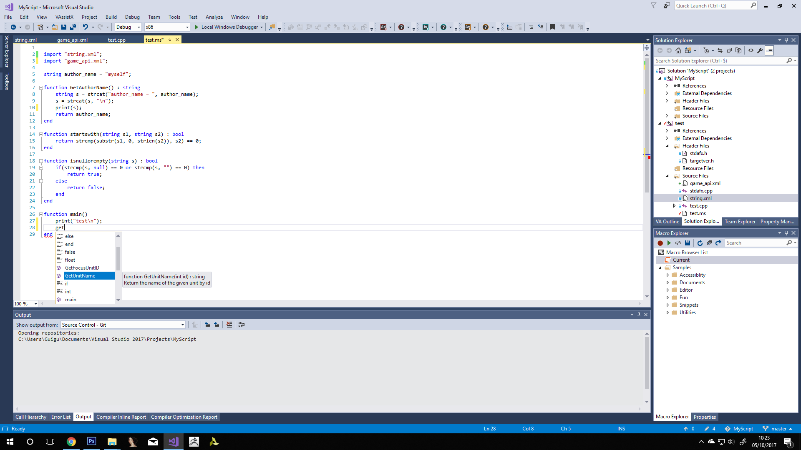

# MyScript-Language-Service



I initially just wanted syntax coloring for myscript files in vs2017, for it to be more user friendly.
But since I had some similar code for another project I pushed it a bit further.

## About the code
The code is all in c#, using Managed Extensibility Framework (MEF), as this is the prefered way to do it nowadays.
A legacy language service is still registered for the language option page to be available.

The parser is a hand written recursive descent parser. I chose to just write an other one (as opposed to reusing the c++ code from MyScript) because dealing with interoperability in c++/cli would have taken even longer anyway.

## Installation
Just compile the code in release mode, then go to "MyScript Language Service\MyScript language service\bin\Release".
Execute "MyCompany.LanguageServices.MyScript.vsix". You will need to close visual studio for the operation to complete. Do it, restart
and open a .ms file. Should work.

## Documentation
Currently only the following features are available :
 - Brace matching
 - Syntax coloring
 - Code completion
 - Syntax errors
 - Outlining
 - Quick info tips
 - Signature help
 - xml documentation
 
Some may not work perfectly. I did not intend to make this a big project or redistribute it. The only features available are those I could
bring without to much hassle.

Intellisense/refactoring/code helper tools can get really complicated really fast. Even though we know all those features
and they seem very simple, its all because they are made for it to look simple and intuitive. Under the hood they are all pretty
complicated.

Most of the features, even the simple ones require context information, which is given by the AST which itself is built (usually)
within a background thread, that means synchronization, and that means slow.
Why do we need context information? In simple terms, because most languages are built left-to-right (amongst other things).

To know we are inside a comment, you need to check the begining of the comment.

This is why so many tools are struggling to bring you the result you need in time. Especially in complex languages based exclusively on source
files like c++.

Anyway this extension should be sufficient to make .ms files coding enjoyable.

### XML Documentation
To make .ms files easy to use in any project type, and even outside of a project, documentation source can be added as a xml file
then referenced from every script file using the following syntax :

```
import "filename";
```

Imported files path is always relative to the current source file.
Xml documentation files are very simple. You can check IntellisenseDoc.xsd or the provided samples.
